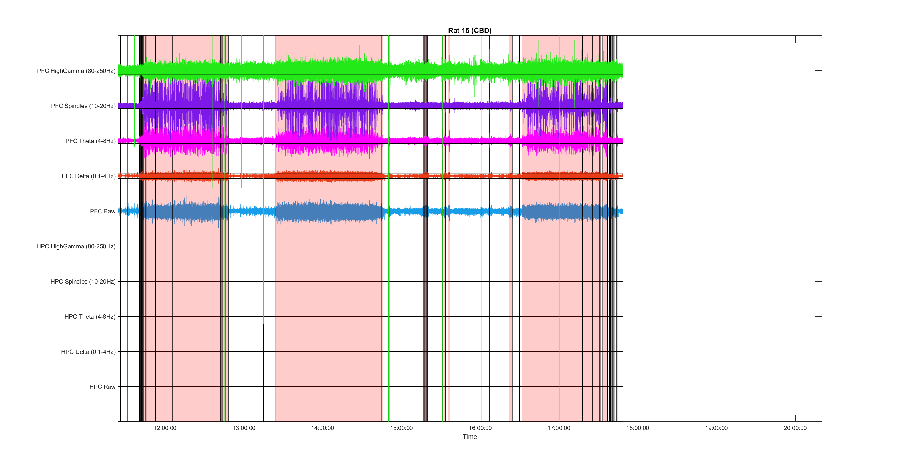

# CBD 🌿 (pre-Tuk OUTDATED version)

# Table of contents

 * Original codes (Different versions):
   * EceGamze.m
   * EceGamze_CBD.m
   * myfirstdraft.m (Irene's code)

 * Pipeline by Adrian:
   * Define New Experiment using GUI (gui_spectral.m from [CorticoHippocampal](https://github.com/Aleman-Z/CorticoHippocampal) ) and save in CBD_X.mat.
   * CBD_Adrian.m: Finds durations of trials, downsamples data and saves.
   * plot_matrix.m: Plots raw signals of all animals for each brain region.
   

   * plot_matrix_bands.m: Plots frequency bands of raw signals per brain region.
   

   * plot_matrix_bands_all_areas.m: Plots all bands for both areas simultaneously.   
   
   
   * plot_matrix_bands_all_areas_stages.m: Plots all bands for both areas simultaneously while detecting on and off states.   
   
   
 * CBD_downsample_500Hz.m: Code for further downsampling to 500Hz. Consumes less memory than 1kHz sampled data.  

 * Power_ratio_MT_MovingWin.m: Spectral analysis and binning.  
 * States_scoring_HPC.m

  
 
